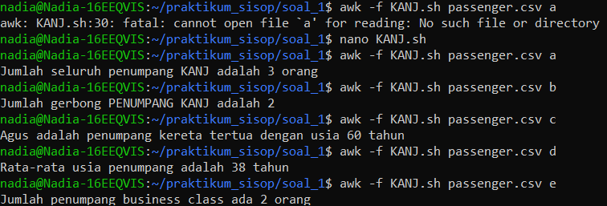
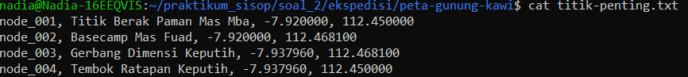
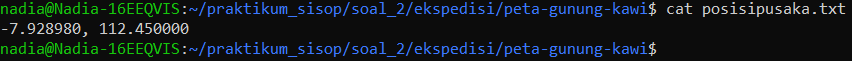
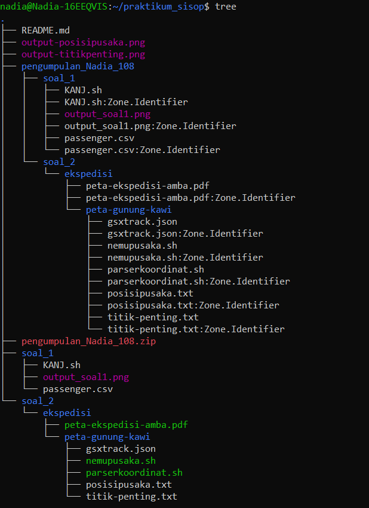
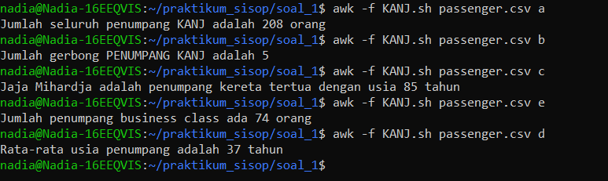

# SISOP-1-2026-IT-108

## Laporan Resmi Modul 1 by Nadia Iqlima Al-Fairuz | 108

### Soal 1
**Penjelasan** 

Pada soal ini, kita diharapkan untuk menganalisis data penumpang dari kereta Argo Ngawi Jesgejes (KANJ). Dimana datanya nanti akan disimpan dalam file `passenger.csv` yang isinya merupakan daftar dengan nama, gerbong, usia, dan kela spenumpang. target pengolahan ini ditujukkan untuk mendapatkan data statistik penumpang yang spesifik. Pada kali ini saya memakai shell scripting dibarengi dengan `awk`, karena awk sendiri sangat cocok dipakai untuk mengolah data berbentuk tabel seperti CSV.

### A. Isi Data dari 'passenger.csv'

```bash
nama,gerbong,usia,class
Budi Hartanto,34,Economy,Gerbong2
Sinta Livia,28,Business,Gerbong1
Andi Zaky,45,Economy,Gerbong4
```

dalam kode dibutuhkan koma untuk memisahkan antara kriteria menggunakan `FS=","` pada AWK. Hal yang terlampir dalam data ini adalah:
- kolom pertama = Nama Penumpang
- Kolom kedua = Gerbong
- Kolom ketiga = Usia
- Kolom keempat = Kelas

### B. Penjelasan Code
 ```bash
 BEGIN {
    FS = ","
    option = ARGV[2]
    delete ARGV[2]

    total_p = 0
    max_age = -1
    oldest_name = ""
    sum_age = 0
    business_count = 0
 }
```
Pada kode tersebut saya menggunakan `FS=","` supaya AWK dapat membaca kalau data perlu dipisahkan dengan koma. lalu pada `option = ARGV[2]` ini digunakan untuk mengimput user, misalnya mau pilih soal a, b, c, d atau e. penting untuk menggunakan `delete ARGV[2]` agar AWK tidak mengira itu adalah file tambahan, yang seharusnya adalah parameter.

**Penjelasan Variabel**

| Variabel         | Fungsi                                      |
|------------------|---------------------------------------------|
| `total_p`        |  menghitung jumlah penumpang           |
| `max_age`        |  menyimpan usia tertua                 |
| `oldest_name`    |  menyimpan nama penumpang tertua       |
| `sum_age`        |  menjumlahkan seluruh usia penumpang   |
| `business_count` |  menghitung penumpang Business Class   |
| `carriages`      |  menyimpan gerbong unik                |
| `count_carriage` |  menghitung jumlah gerbong             |
| `option`         |  menyimpan pilihan soal (a–e)          |

**Proses Data**
```bash
NR > 1{
   #hitung total penumpangnya(A)
   total_p++

   #untuk jml gerbong (B)
   carriages[$2] = 1

   #penumpang tertua(C)
   if ($3 > max_age) {
       max_age = $3
       oldest_name = $1
   }
   #rata rata tot. usia(D)
   sum_age += $3

   #hitung bisnis class(E)
   if ($4 == "Business") {
       business_count++
   }
}
```
Pada kode tersebut `NR >1` sangat perlu digunakan agar baris pertama (header) tidak ikut dihitung. lalu `total_p++` pada fungsi menghitung total penumpang, itu digunakan untuk menambah jumlah penumpang tiap baris. Bagian `carriages[$2] = 1` dipakai untuk menyimpan gerbong yang unik, sehinga jika muncul gerbong yang sama berulang kali tetap dihitung 1. untuk mencari penumpang tertua memakai `if ($3 > max_age)` sehingga setiap bertemu dengan usia yang lebih besar, langsung disimpan. kemudian `sum_age += $3` dipakai untuk menjumlah rata rata usia, dan yang terakhir `if ($4 == "Business")` untuk mengecek apakah penumpang tersebut termasuk kategori penumpang kelas bisnis, jika iya maka akan ditambahkan ke data melalui `business_count++`

**Bagian End (Output)**

```bash 
END {
     if (option == "a") {
         printf "Jumlah seluruh penumpang KANJ adalah %d orang\n", total_p
     } else if (option == "b") {
     count_carriage = 0
     for (c in carriages) {
         count_carriage++
       }
         printf "Jumlah gerbong PENUMPANG KANJ adalah %d\n", count_carriage
     } else if (option == "c") {
         printf "%s adalah penumpang kereta tertua dengan usia %d tahun\n", oldest_name, max_age

     } else if (option == "d") {
     if (total_p >0) {
         printf "Rata-rata usia penumpang adalah %d tahun\n", int(sum_age / total_p)
       }

     }else if (option == "e") {
         printf "Jumlah penumpang business class ada %d orang\n", business_count
     } else {
         print "Soal tidak dikenali. Gunakan a, b, c, d, atau e."
         print "Contoh penggunaan: awk -f KANJ.sh passenger.csv a"
     }
  }
  ```
  disini program akan melihat pilihan user yang akan di input

## Penjelasan Opsi Program

|  Opsi  | Fungsi                                                                 |
|--------|------------------------------------------------------------------------|
|  `a`   | menampilkan jumlah seluruh penumpang                                   |
|  `b`   | menghitung jumlah gerbong unik yang digunakan                          |
|  `c`   | menampilkan nama dan usia penumpang tertua                             |
|  `d`   | menghitung rata-rata usia penumpang (dibulatkan tanpa desimal)         |
|  `e`   | menghitung jumlah penumpang yang termasuk Business Class               |

### C. Kode Lengkap
```bash 
BEGIN {
FS = ","
option = ARGV[2]
delete ARGV[2]

total_p = 0
max_age = -1
oldest_name = ""
sum_age = 0
business_count = 0

}

NR > 1{
   #hitung total penumpangnya(A)
   total_p++

   #untuk jml gerbong (B)
   carriages[$2] = 1

   #penumpang tertua(C)
   if ($3 > max_age) {
       max_age = $3
       oldest_name = $1
   }
   #rata rata tot. usia(D)
   sum_age += $3

   #hitung bisnis class(E)
   if ($4 == "Business") {
       business_count++
   }
}

END {
     if (option == "a") {
         printf "Jumlah seluruh penumpang KANJ adalah %d orang\n", total_p
     } else if (option == "b") {
     count_carriage = 0
     for (c in carriages) {
         count_carriage++
       }
         printf "Jumlah gerbong PENUMPANG KANJ adalah %d\n", count_carriage
     } else if (option == "c") {
         printf "%s adalah penumpang kereta tertua dengan usia %d tahun\n", oldest_name, max_age
         
     } else if (option == "d") {
     if (total_p >0) {
         printf "Rata-rata usia penumpang adalah %d tahun\n", int(sum_age / total_p)
       }

     }else if (option == "e") {
         printf "Jumlah penumpang business class ada %d orang\n", business_count
     } else {
         print "Soal tidak dikenali. Gunakan a, b, c, d, atau e."
         print "Contoh penggunaan: awk -f KANJ.sh passenger.csv a"
     }
  }

```
### D. OUTPUT
 

### E. Kendala
tidak ada

### Soal 2
**Penjelasan**

Pada soal kedua, kita diharapkan untuk mencari lokasi pusaka sakti yang disembunyikan oleh paman dari Mas Amba, data lokasi tersebut tersimpan dalam file `gsxtrack.json` yang berisikan beberapa titik penting dengan informasi `id`, `site_name`, `latitude`, dan `longitude`. Target yang ingin dicapai dalam pengolahan data ini adalah merapikan data koordinat kedalam `titik-penting.txt`, lalu menentukan titik tengah diagonal dari titik-titik tersebut dan menyimpan nya ke file `posisipusaka.txt`

pada kali ini saya memakai shell scripting dibarengi dengan `awk` karena `awk` sangat cocok dipakai untuk membaca dan mengelola data teks terstruktur seperti JSON sederhana dan file hasil parsing.

### A. Isi Data dari gsxtrack.json

File `gsrxtrack.json` ini nantinya akan berisi beberapa titik lokasi dan titik lokasi tersebut akan digunakan untuk menentukan titik pusat. Data yang dibutuhkan dari file ini adalah

- `id`
- `site_name`
- `latitude`
- `longitude`

setelah data terisikan, biasanya data nanti akan berbentuk seperti ini:

- "id": "node_001"
- "site_name": "titik berak"
- "latitude": "-3,29344.."
- "longitude": "112.234.."

setelah diparsing, nantinya kode tersebut akan berbentuk seperti tabel dan kolom. Kolom pertama berisikan id node, kolom kedua berisikan nama lokasinya, kolom ketiga berisikan latitude, kolom keempat berisikan longitude.

### B. Parserkoordinat.sh

```bash
#!/bin/bash

awk '
/"id": "node_/ {
  split($0, a, "\"")
  id = a[4]
}

/"site_name"/ {
  split($0, a, "\"")
  name = a[4]
}
/"latitude"/ {
  split($0, a, ": ")
  lat = a[2]
  sub(/,/, "", lat)
}
/"longitude"/ {
  split($0, a, ": ")
  lon = a[2]
  sub(/,/, "", lon)
  print id ", " name ", "lat ", " lon
}
' gsxtrack.json > titik-penting.txt
```
Pada kode tersebut saya menggunakan `awk` untuk mengambil data penting dari gsxtrack.json, seperti yang dilihat pada bagian `/id/`, `/site_name/`, `/latitude/`, `/longitude/`, dipakai untuk mendeteksi baris yang berisikan data yang dibutuhkan.

Lalu fungsi `split($0, a, "\"")` digunakan untuk memisahkan isi baris berdasarkan tanda kutip agar nilai seperti `id` dan `site_name` bisa diambil. Sedangkan untuk `latitude` dan `longitude`, perlu dipisahkan dengan `split($0, a, ": ")` agar angka koordinatnya bisa didapatkan.

Bagian `sub(/,/, "", lat)` dan `sub(/,/, "", lon)` digunakan agar koma di akhir angka hilang supaya hasilnya bisa bersih. setelah semua data dalam satu titik sudah didapatkan, hasilnya akan dicetak ke file `titik-penting.txt` dengan format: 

```bash
id, site_name, latitude, longitude
```
**Hasil Output**

 


**Ringkasan Penjelasan Variabel**

|  Variabel  | Fungsi                                                                 |
|--------|------------------------------------------------------------------------|
|  `id`   | menyimpan id node                                   |
|  `name`   | menyimpan nama lokasi                          |
|  `lat`   | menyimpan nilai latitude                             |
|  `lon`   | menyimpan nilai longitude         |
|  `ea[]`   | array sementara hasil `split`               |

### C.nemupusaka.sh

Selanjutnya, `nemupusaka.sh` berfungsi untuk menemukan lokasi pusaka yang disembunyikan berdasarkan data koordinat yang telah didapatkan pada file `titik-penting.txt`.

kode ini bekerja dengan mengambil dua titik yang saling berseberangan (diagonal) secara terpisah antara longitude dan latitude, yaitu dengan titik pertama dan titik keempat. Kemudian dilakukan perhitungan titik tengah dengan menggunakan rumus rata-rata koordinat seperti pada soal.

Hasil akhir kemudian disimpan ke dalam file `posisipusaka.txt`.

```bash
  GNU nano 6.2                                  nemupusaka.sh                                           #!/bin/bash

lat1=$(awk -F', ' 'NR==1 {print $3}' titik-penting.txt)
lon1=$(awk -F', ' 'NR==1 {print $4}' titik-penting.txt)

lat2=$(awk -F', ' 'NR==4 {print $3}' titik-penting.txt)
lon2=$(awk -F', ' 'NR==4 {print $4}' titik-penting.txt)

mid_lat=$(awk "BEGIN {printf \"%.6f\", ($lat1 + $lat2)/2}")
mid_lon=$(awk "BEGIN {printf \"%.6f\", ($lon1 + $lon2)/2}")

echo "$mid_lat, $mid_lon" > posisipusaka.txt
cat posisipusaka.txt
```

Pada kode tersebut, langkah pertama saya mengambil data koordinat file `titik-penting.txt` menggunakan `awk -F', '` supaya anatar kolomnya nanti akan terpisah dengan koma dan spasi. Lalu pada bagian `NR==1` digunakan untuk mengambil titik yang pertama, sedangkan `NR==4` digunakan untuk mengambil titik keempat. Dari kedua baris tersebut, saya mengambil nilai koordinatnya, yaitu latitude dan longitude (kolom ke-3 dan ke-4) yang nantinya akan dipakai untuk menghitung titik tengah lokasi pusaka.

setelah itu latitude dan longitude dihitung menggunakan rumus rata-rata dua koordinat:

- latitude tengah = (lat1 + lat2) / 2
- longitude tengah = (lon1 + lon2) / 2

Perhitungan nantinya akan dilakukan dengan menggunakan `awk "BEGIN {...}"` karena `awk` biasa dipakai untuk operasi aritmetia desimal. Format `%.6f` dipakai agar hasil koordinatnya memiliki 6 angka dibelakang koma.

Hasil akhirnya akan disimpan dalam file `posisipusaka.txt`, lalu ditambilkan dengan menggunakan `cat`

**Hasil Output**

 


**Ringkasan penjelasan variabel**
|  Variabel  | Fungsi                                                                 |
|--------|------------------------------------------------------------------------|
|  `lat1`   | menyimpan latitude titik pertama                                   |
|  `lon1`   | menyimpan longitude titik pertama                          |
|  `lat2`   | menyimpan latitude titik kedua/diagonalnya                             |
|  `lon2`   | menyimpan longitude titik kedua/diagonal         |
|  `mid_lat`   | menyimpan hasil titik tengah latitude               |
|  `mid_lon`   | menyimpan hasil titik tengah longitude              |

### Kendala
tidak ada

### Tampilan tree

 

## REVISI

pada soal pertama, saya tidak menggunakan full data dari `passenger.csv` hanya memakai beberapa data saja, sehingga output nya tidak sesuai dengan yang diminta dari soal. setelah saya ubah pada bagian `passenger.csv` dan `KANJ.sh` untuk menyesuaikan data baru, maka didapatkan hasil output sebagai berikut :

**Output soal_1 yang terbaru**

 
